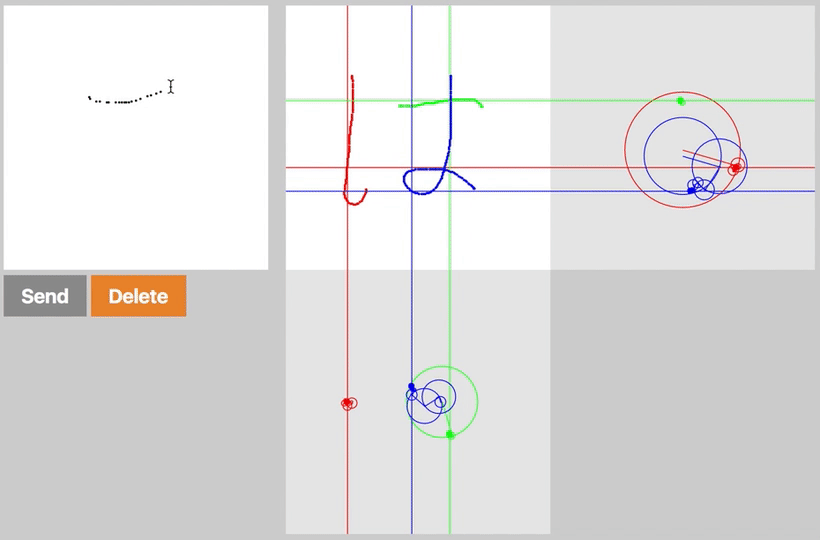

# metaMOJIphose
metamorphose + moji

- Visualizes metamorphosis of handwritten strokes with circular motions, using Fourier series expansion.  
- You can give characters as many as you want, so long as number of their strokes are equal to the first one's.

Start [here](https://satoken912.github.io/metamojiphose/)